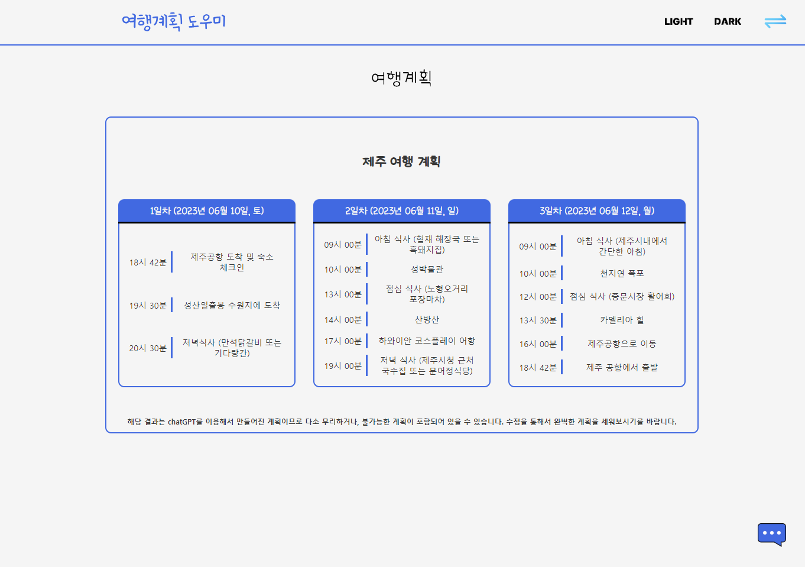
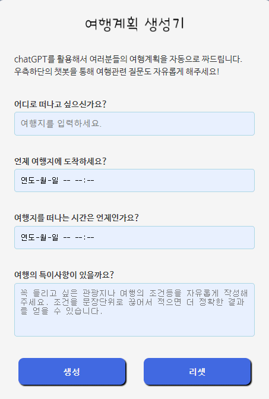
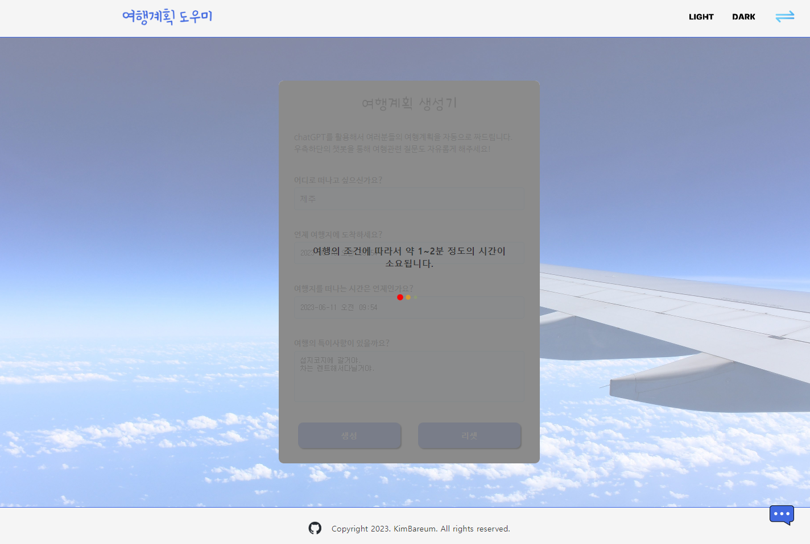
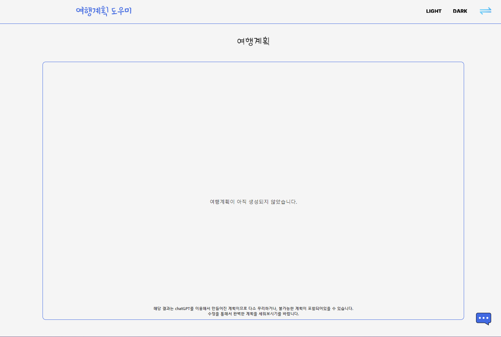
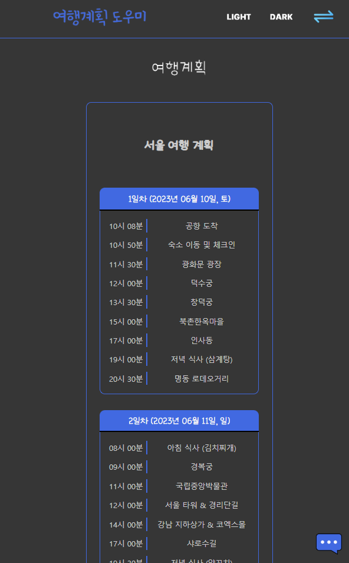

# 여행계획 도우미

## 주제

openAI API를 활용하여 여행계획을 생성해서 카드형식으로 보여주고, 챗봇을 통해 여행계획에 대한 도움을 받을 수 있는 웹 어플리케이션

## 프로젝트의 목표

1. 바닐라 HTML, CSS, JS로 웹페이지를 구현한다.
2. 클래스를 기반으로 한 컴포넌트 구조로 웹페이지를 구현한다.
3. JS 코드들을 최대한 기능 단위로 모듈화 한다.
4. 웹 페이지의 요소들에 동적인 요소들을 추가해서 사용자에게 피드백을 준다.
5. API 와의 통신을 하고, 결과 값에 대한 예외처리를 한다.
6. chatGPT AI에서 원하는 결과 값을 얻기 위한, 입력 값을 주는 방법을 확인한다.
7. CSS에서 flex를 활용해서 깔끔한 화면을 만든다.
8. 모바일 환경에서도 사용이 가능하도록 CSS를 조정한다.

## 배포주소

https://kimbareum.github.io/TravelPlanHelper/

## 개발 환경 및 개발 기간

-   개발 환경  
    Vanilla JavaScript, CSS

-   개발 기간  
    2023년 5월 30일 ~ 2023년 6월 10일

## 사용 예제

### - 여행계획 생성 및 뷰어 기능

 

    - 여행계획 생성기에서 목표 여행지와, 여행지에 도착하는 시간, 여행지에서 떠나는 시간을 넣고 생성을 누르면,
    openAI API를 통해서 얻어진 여행계획이 뷰어 슬라이드에 카드 형식으로 나타난다.
    - 슬라이드간의 전환은 우측 상단의 버튼이나 드래그, 스와이프로 가능하다.

### - 여행 챗봇기능


    - 우측하단의 파란색 메세지 아이콘을 누르면 여행관련 질문에 응답하는 챗봇을 이용할 수 있다.

### - 세부 구현 기능

-   슬라이드 기능


    - 메인스크린을 section 2개를 가진 슬라이드 형태로 구성.
    - 버튼, 드래그, 스와이프를 통해 슬라이드를 전환.
    - 내용 복사와 조작감을 고려해서 세로로 일정이상 이동한 경우에는 슬라이드가 전환되지 않도록 세팅.

-   여행계획 생성 기능



    - 여행의 목적지, 시작시간, 종료시간, 그외 특이사항을 입력하면 chatGPT를 통해 여행계획을 생성.
    - 여행의 목적지와 시작시간, 종료시간은 필수 입력요소로서 입력되지 않으면 입력되지 않은 곳을 포커스하고,
    시각적으로 피드백.
    - 시작시간이 현재시간보다 빠르거나, 여행종료시간이 시작시간보다 빠를 경우에도 잘못된 곳을 포커스하고,
    시각적으로 피드백.
    - textarea에서도 enter키로 submit이 가능하고, shift + enter키로는 줄 바꿈이 작동하게 설정.
    - 모바일 환경에서는 기존과 동일하게 enter키로 줄 바꿈이 되도록 설정.

 

    - API 응답을 대기하고 있을 때는 입력 창 위에 예상시간과 로딩 바를 표기.
    - API 응답의 결과가 올바르지 않을 때는 모달로 만든 경고 창을 띄워서 생성이 제대로 되지 않았음을 안내.
    - 정상적으로 생성된 여행 계획은 로컬 스토리지에 저장.

-   여행계획 뷰어 기능

 

    - 최초 접속 시에는 로컬스토리지에 데이터가 있는지 확인하고, 없다면 초기 화면을 렌더링.
    - 로컬 스토리지에 저장된 여행 계획을 불러와서 화면에 카드 형태로 렌더링.

-   여행 챗봇 기능

 

    - 화면 구석에 fixed된 채팅 아이콘으로 챗봇을 토글하게 만듦.
    - 질문하기를 누르면 값이 있는지, 응답이 대기 중이지 않는지 확인하고 API 요청.
    - enter키로 submit이 가능하고, shift + enter키로는 줄 바꿈이 작동하게 설정.
    - 모바일 환경에서는 기존과 동일하게 enter키로 줄 바꿈이 되도록 설정.
    - API 응답을 대기 중일 때는 스크린에 로딩 바를 띄워서 동적으로 피드백.
    - API응답이 왔을 때 움직이는 애니메이션을 줘서 동적인 버튼을 구성.
    - API 응답이 실패했을 때는 모달로 만든 경고 창을 띄워서 답변이 정상적으로 만들어지지 않았음을 안내.
    - 화면이 렌더링될 때 마다 챗봇의 화면이 가장 아래로 내려가게 설정.

-   테마에 따른 화면 변경

 

    - 우측 상단의 LIGHT, DARK 버튼을 통해서 다크테마와 라이트테마를 전환 할 수 있도록 구성.

-   동적 UI


    - 테마변경 버튼, 화면 슬라이드 버튼, 챗봇 토글 버튼에 hover조건을 줘서 동적인 UI로 구성.
    - form의 입력, 리셋버튼에는 hover시와 active시 조건을 줘서,
    hover시에는 올라가고, 클릭 시에는 들어가는 것처럼 보이는 동적인 UI로 구성.
    - 슬라이드의 전환 시 화면이 밀리는 듯 한 효과를 줌.

-   반응형 화면 구성


    - 모바일 화면에서는 헤더의 좌우 공백을 줄이고 테마 선택버튼이 토글 되는 하나의 버튼이 되도록 변경.
    - 모바일 화면에서는 배경을 없애고 여행계획 생성기의 입력 폼만 나타나도록 변경.
    - 동적 UI의 hover 조건을 active 조건으로 변경하여 모바일에서 조금 더 자연스러운 동적 UI로 보이도록 변경.

 
 

    - 여행계획 뷰어는 좌우 폭에 따라서 카드를 1줄에 4장, 3장, 2장, 1장씩 표기되도록 단계적으로 변경.

## 프로젝트 구조

```shell
|   index.html
|
\---src
    |   main.js
    |
    +---api
    |       dataRecord.js
    |       openAIApi.js
    |
    +---components
    |   |   App.js
    |   |   ChatBot.js
    |   |   Header.js
    |   |   Slide.js
    |   |
    |   +---chat_bot
    |   |       ChatApi.js
    |   |       ChatForm.js
    |   |       ChatScreen.js
    |   |       ToggleChatBot.js
    |   |
    |   +---common
    |   |       AlertModal.js
    |   |       Button.js
    |   |       commonBoxes.js
    |   |       Input.js
    |   |       LoadingScreen.js
    |   |
    |   +---header
    |   |       SlideButton.js
    |   |       ToggleTheme.js
    |   |
    |   \---slide
    |       |   PlanGenerator.js
    |       |   PlanViewer.js
    |       |   SlideControl.js
    |       |
    |       +---plan_generator
    |       |       Footer.js
    |       |       GeneratorApi.js
    |       |       GeneratorForm.js
    |       |
    |       \---plan_viewer
    |               CardBox.js
    |               PlanBox.js
    |
    +---data
    |       apiData.js
    |       imgPaths.js
    |
    +---img
    |       background_main.jpg
    |       background_main_dark.jpg
    |       icon_ai_chat.png
    |       icon_chatbot.png
    |       icon_darkmode_dark.png
    |       icon_darkmode_light.png
    |       icon_exchange.png
    |       icon_github.png
    |       icon_github_white.png
    |       icon_lightmode_dark.png
    |       icon_lightmode_light.png
    |       logo_generator.png
    |       logo_generator_dark.png
    |       logo_header.png
    |       logo_viewer.png
    |       logo_viewer_dark.png
    |
    +---style
        |   style.css
        |
        \---font
                Nanum_barun_gothic.ttf
               Nanum_barun_gothic_bold.ttf
                ohmyu_daibbm.ttf
```

## 개발 과정

1. 기능 구현 단계  
   생전 처음 진행해보는 프로젝트인데다, 사용하는 언어도 평소에 사용하던 파이썬이나 C++도 아닌 만큼 모듈화도, 가독성도 고려하지 않은 채 기능 구현과 화면의 구성에만 집중해서 코드를 작성했다.

    그러다보니 코드리뷰 과정에서는 일단 파일을 분리하고 폴더 트리를 만들 것, 공용으로 사용할 수 있는 부분들은 따로 분리할 것, 하나의 함수에 너무 많은 기능을 넣지 말 것 등을 조언 받았고, 디자인적으로는 화면의 이미지나 구성요소는 의미 있는 위치에 배치할 것, 구성요소에는 패딩을 넣어서 시원한 느낌을 주도록 할 것, 구성요소 간에 구분감을 줄 것, UI에 과한 동적 요소는 넣지 말 것 등을 조언 받았다.

    이를 바탕으로 우선 디자인적인 부분부터 고쳐나가기 시작했다.

2. 디자인 개선 단계  
   
   

    초기디자인은 위와 같았다. 메인이미지가 아무런 의미 없이 배치되어 있었고, 우측 상단의 버튼은 평소에도 좌우로 움직이고 있었다. 여행계획 생성기부분의 padding도 부족했고, 여행계획 뷰어 부분에는 안내문구가 적절하지 않은 위치에 자리하고 있고, 카드 내부 요소들의 구분감이 부족하고, 하단의 일관되지 않은 여백도 보기에 좋지 않았다.  
     그리고 개인적으로 화면에 위치하고 있는 색상이 비슷한 계열이긴 하지만 너무 많다는 느낌을 받았다. 이를 바탕으로 피드백을 통해서 다음과 현재와 같은 디자인으로 개선할 수 있었다.

    또한 동적인 UI도 최대한 많은 부분에 적용하려고 노력해보았다. 사용자의 클릭을 받는 부분에서는 hover시나 active시 각각의 CSS를 적용해서 상호작용이 가능한 요소라는 부분을 보여주려고 노력했고, 슬라이드나 테마 버튼이 변하는 부분에서는 화면이나 버튼이 움직이는 듯 한 효과를 주고, 로딩 창에는 움직이는 요소를 넣어서 화면의 동작에 대한 피드백을 주고자 하였다.  
     또한 여행계획 생성부의 입력 창에는 유효성 검증 로직에서 CSS와 JS를 통한 피드백을 넣어서 사용자가 눈치 채기 편하도록 하였다.

3. 코드의 모듈화 단계  
   코드리뷰에서 받은 피드백을 바탕으로 CSS 파일과, 사용하는 이미지, JS파일, 공용으로 사용하는 JS 파일들로 기능을 분리하고, 기존에 작성했던 코드내의 함수들을 최대한 기능별로 쪼개는 것을 시도해보았다.

    하지만 이벤트를 다뤄야 할 때, 이벤트리스너에서 특정함수를 불러오고, 그 함수가 다른 함수를 불러오고, 그 함수가 다른 함수를 불러오는 식으로 작동하는 부분에서 많은 불편함을 느꼈다. 뭔가 기능을 추가하거나 알고리즘을 수정할 때마다, 이 함수의 리턴 값을 다른 곳으로 보내고, 달라진 결과 값은 다른 함수를 수정해서 다른 방식으로 처리하게 하는 과정이 너무 복잡하게 느껴졌다. 다음 과정을 위한 공부 중 알게 되었던 용어로 설명해보자면 코드의 결합도가 너무 높았던 것 같다.

    이런 상황에서 부트캠프의 수업 중 컴포넌트라는 개념을 듣게 되었고, 이를 공부해서 자신의 코드에 적용해보자는 마음을 가지게 되었다.

4. 컴포넌트 적용 단계

-   컴포넌트 방식의 결정  
     컴포넌트라는 키워드를 처음 듣고 구글에서 컴포넌트에 대한 다양한 문서들을 찾아보았을 때, 많은 튜토리얼이 React의 클래스 컴포넌트를 기반으로 작성되어 있었다.

    컴포넌트라는 개념을 처음 들었고, 애초에 웹페이지를 만든다는 경험이 처음이기 때문에 기왕이면 튜토리얼이 있는 방식을 사용하고 싶었고, 객체지향적인 프로그래밍에 대한 이해도 키우고 싶다는 생각에 이 방식으로 진행하기로 결정했다.

    하지만 JavaScript를 처음 사용해보는 만큼, 외부 라이브러리는 사용하고 싶지 않아서, 클래스구조와 state를 통해서 변경사항을 주고받는 방식만 가져와서 chatGPT와 튜토리얼들을 이용해서 비슷한 구조를 만들어보고자 했다.

-   기능별 컴포넌트의 분리  
     리팩토링 작업에 들어간 후 처음 한 작업은 각 기능별로 컴포넌트를 만드는 것이었다.

    헤더부분, 메인섹션의 여행계획 생성기부분과 여행계획 뷰어부분, 챗봇부분으로 나눠서 컴포넌트를 만들고, 각 컴포넌트에서 입력을 받는 부분, 화면을 조작하는 부분, API 응답을 받는 부분들을 다시 하위컴포넌트로 만드는 과정을 통해서 컴포넌트들이 최대한 하나의 기능만 수행하도록 분리하였다.

    이 과정에서 state를 통해서 데이터와 현재의 상태(어떤 작업을 하고 있는지)를 주고받고 state의 상태에 따라서 다른 동작을 수행하도록 구성하였다.

-   state에 대한 고민  
    앞서 작성했던 것처럼, state를 통해서 데이터와 현재의 상태를 주고받고 state의 상태에 따라서 다른 동작을 수행하도록 컴포넌트간의 상호작용을 구성했는데, 이런 방식의 상호작용은 컴포넌트를 적용하려던 이유를 전혀 충족시키지 못했다.

    외부 라이브러리의 보조 없이 데이터를 state를 통해서 직접적으로 주고받다보니 결국 기능을 추가하거나 알고리즘을 수정할 때마다 데이터 자체를 가공하고, 데이터가 전해지는 컴포넌트를 수정해야했는데, 앞서 작성했던 방식과 전혀 다른 점이 느껴지지 않았다.

    Redux나 Recoil 등의 상태관리 라이브러리에 대해서도 알아보고 추가할 수 있을지 고민을 해보았지만, 첫 프로젝트인 만큼 이러한 것들을 도입하기에는 너무 무겁다는 생각이 들었고, 사용하는 라이브러리를 최소한으로 하고싶다는 생각에 도입을 하지않았다.
    이런 상황에서 이러한 문제를 해결하기 위해 고민도하고 chatGPT와 열띤 토론도 해보면서 state로는 오직 상태만을 전달해서 일종의 스위치 처럼 작동하게 하고, data는 다른 js파일에 선언된 data용 변수나, 로컬스토리지를 통해서 주고받는 방식이 좋겠다는 생각이 들었고, 이를 적용해본 결과, 앞서 작성했던 코드들 보다 기능의 추가나 작동방식의 수정이 훨씬 쉬워지는 것을 느꼈다.

-   공용컴포넌트의 분리와 재사용성  
     여기까지 진행한 이후의 코드리뷰에서 공용컴포넌트의 분리에 대한 조언을 들었다.

    이를 바탕으로 입력창을 담당하는 Input 이라는 공용컴포넌트를 만들고 값을 얻어오는 메서드, 값을 초기화시키는 메서드, 입력창에 포커스 시키는 메서드, 이벤트 리스너를 추가하는 메서드를 넣어서, 다양한곳에서 입력창을 간단하게 만들고, 기능들을 편하게 사용할 수 있도록 구성했고, 버튼도 비슷한 방식으로 구성했다.

    그리고 이미 만들어져있던 로딩스크린을 공용컴포넌트로 분리하고, 이후에 만든 Alert 용도로 사용할 Modal창도 공용컴포넌트로 만들어서 여행계획 생성기부분과 챗봇 부분에 사용하였다.

    이전에는 입력 창을 하나씩 일일이 만들고, getValue 메서드를 전부 집어넣는 식의 불필요한 반복 작업을 수행하였는데, 이러한 부분이 상당히 편해진다는 것을 느꼈다.

    이를 바탕으로 기존 작성된 코드에서도 재사용성과 확장성을 고려해서 일부분을 리팩토링하는 작업을 진행하였다.

-   마무리  
    이후에는 세부적인 기능들을 추가하고 앞서 작성한 코드들을 다듬고, 주석을 작성하면서 마무리 작업을 진행하였다.

## 느낀 점과 아쉬운 점

자바스크립트 자체에 상당히 친숙해지는 듯한 느낌을 받았고, 함수나 메서드, 컴포넌트들을 최대한 기능단위로 잘게 쪼개고, 서로간의 상호작용에서는 꼭 필요한 부분만 주고받게 하면, 이후에 코드의 수정이나 기능을 추가하는 과정에서 어마어마한 효율의 차이가 발생한다는 점을 느낄 수 있었다. 또한 객체와 메서드의 장점도 많이 느낄 수 있는 프로젝트였다.

하지만 많은 아쉬운 점도 존재한다.

1. CSS  
   CSS 적용은 명확한 계획 없이 한 부분을 완성하면 그 부분에 대한 CSS를 작성하고, 다음부분을 완성하면 다시 CSS를 작성하는 식으로 진행하다보니, 자기 자신이 작성한 CSS에 대한 이해가 어려운 상황이 종종 있었고, 중복되는 부분을 제거한다고 제거했지만, 나중에 살펴보면 또다시 중복되는 부분이 발견되고, 중복된다고 생각해서 지웠더니, 나중에 다른 부분에서 문제가 발생하는 스파게티코드처럼 느껴지는 CSS파일이 완성되었다.

    명확한 계획을 세워놓고 CSS파일을 작성하고, SCSS와 같은 방법을 익혀서 적용 해보는 것도 좋을 것 같다.

2. 컴포넌트간의 상호작용  
   바로 인접해있는 컴포넌트간의 상호작용은 state에서 오직 상태만 주고받는 방식으로 어느 정도 개선되었다고 생각하지만, 다크테마와 라이트테마 기능을 추가하는 과정에서 버튼하나가 헤더와 메인 푸터에 있는 이미지를 모두 바꿔야하는 상황에서 이를 처리할 방법이 너무 막막하게 느껴졌다.  
   결국 이를 CSS에서 background 이미지로 넣는 방식으로 해결하였는데, 기존에 이미지에 있던 alt값을 사용하지 못하는 등의 부분이 아쉽게 느껴졌다.

    또한 모든 이벤트의 처리를 state와 콜백함수를 통해서 했는데, 이벤트 버블링이나 인터페이스 등의 방식도 더 알아보고 사용해보고 싶다.

3. 객체지향  
   클래스 문법을 사용하긴 했지만, 상속이나 이를 이용한 인터페이스 구조 등은 전혀 이용하지 않았다.  
   각종 버튼들은 상속을 통해서 사용 할 수도 있었을 것 같은데, 어느 부분에 어떤 방식으로 사용해야 할지에 대한 방향성을 제대로 알지 못해서 결국 상속을 제외한 상태로 코드를 작성했다.  
   조금 더 개선된 부분이 있지는 않았을까 아쉬움이 남는다.

4. 그 외  
   우선 코드를 전부 작성한 이후, 클래스방식의 컴포넌트가 현재는 주류가 아니라는 소식을 들었다. 클래스라는 평소에는 사용하지 않았던 문법을 많이 사용해보면서 많은 것들을 배울 수 있었지만, 다음에는 함수형 컴포넌트로 웹사이트를 구현해보거나, 이 프로젝트를 함수형으로 리팩토링하는 경험도 해보고 싶다.

    또한 코드자체에서 ChatBot의 ToggleChatBot안의 button에 이벤트를 할당하는 부분에서 컴포넌트 내부의 요소와 외부의 요소를 둘 다 조작해야 할 때, 이벤트자체가 상당히 복잡하게 짜졌다고 생각한다.

    Header의 SlideButton은 초기에는 SlideButton을 만들면서 이벤트를 바로 할당하려고 했으나, Header가 먼저 선언되기 때문에 아직 slide가 로딩 되지 않아서 발생하는 문제 때문에, 생성만 Header에서 하고 이벤트는 다른 곳에서 할당하는 구조를 취한 게 아쉽다.  
     또한 Slide 컴포넌트에서 각각의 슬라이드를 추가하는 부분을 자동화해보려 했으나 슬라이드 내부의 메서드를 사용해야 해서 생성된 컴포넌트를 Array에 담는다거나, 내부의 메서드를 다른 변수에 잡아둔다거나 하는 방식을 고민해보았는데, 가독성이 너무 떨어지는 것처럼 느껴져서 지금과 같은 구조로 작성하게 되었는데, 더 좋은 방법이 없었을까 하는 아쉬움이 남는다.

    그리고 각종 컴포넌트에서 내부의 구조가 어떤 컴포넌트는 setState를 통해 render를 실행해서 렌더링하고, 어떤 컴포넌트는 내부의 메서드를 통해 바로 렌더링 하는 등 구조가 일관되지 않은 듯 한 느낌을 받았다. 이 부분도 개선되면 좋지 않았을까 한다.

## 마치며

처음해보는 프로젝트는 여태까지는 해보지 못했던 온갖 것들을 시도해보고, 그 결과물도 코드내적으로도 코드 외적으로도 모두 눈에 띄게 보여서 무엇보다 재미있는 시간이었다. 앞으로도 여태까지 몰랐던 다양한 것들을 알아가고, 새로운 것들도 시도해보면서 더 많은 것들을 해보고 싶다.
