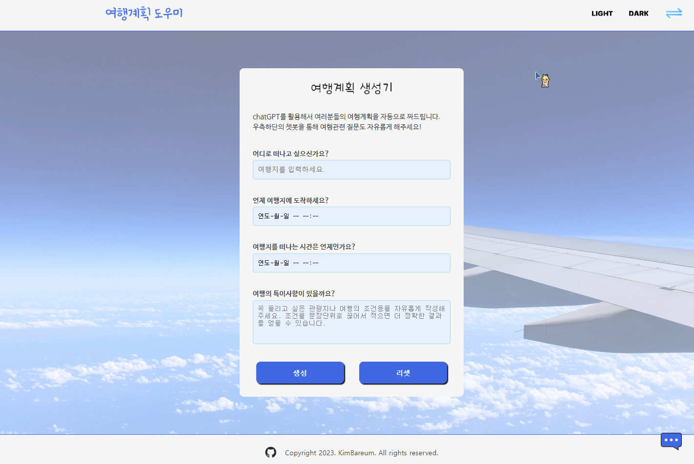
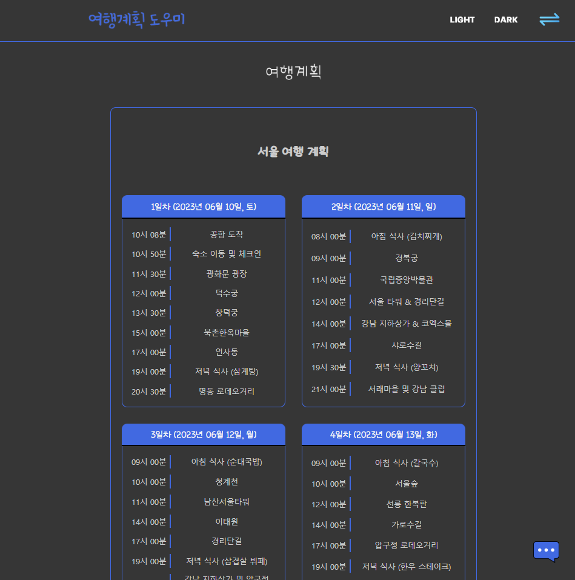

# 여행계획 도우미

## 주제

openAI API를 활용하여 여행계획을 생성해서 카드형식으로 보여주고, 챗봇을 통해 여행계획에 대한 도움을 받을 수 있는 웹 어플리케이션

## 프로젝트의 목표

1. 바닐라 HTML, CSS, JS로 웹페이지를 구현한다.
2. 클래스를 기반으로한 컴포넌트 구조로 웹페이지를 구현한다.
3. JS 코드들을 최대한 기능 단위로 모듈화 한다.
4. 웹 페이지의 요소들에 동적인 요소들을 추가해서 사용자에게 피드백을 준다.
5. API 와의 통신을 하고, 결과값에 대한 예외처리를 한다.
6. chatGPT AI에서 원하는 결과값을 얻기 위한, 입력값을 주는 방법을 확인한다.
7. CSS에서 flex를 활용해서 깔끔한 화면을 만든다.
8. 모바일 환경에서도 사용이 가능하도록 CSS를 조정한다.

## 배포주소

https://kimbareum.github.io/TravelPlanHelper/

## 개발 환경 및 개발 기간

-   개발 환경  
    Vanilla JavaScript, CSS

-   개발 기간  
    2023년 5월 30일 ~ 2023년 6월 8일

## 사용 예제

### - 여행계획 생성 및 뷰어 기능

 

    - 여행계획 생성기에서 목표 여행지와, 여행지에 도착하는 시간, 여행지에서 떠나는 시간을 넣고 생성을 누르면,
    openAI API를 통해서 얻어진 여행계획이 뷰어 슬라이드에 카드 형식으로 나타난다.
    - 슬라이드간의 전환은 우측상단의 버튼이나 드래그, 스와이프로 가능하다.

### - 여행 챗봇기능


    - 우측하단의 파란색 메세지 아이콘을 누르면 여행관련 질문에 응답하는 챗봇을 이용할 수 있다.

### - 세부 구현 기능

-   슬라이드 기능


    - 메인스크린을 section 2개를 가진 슬라이드 형태로 구성.
    - 버튼, 드래그, 스와이프를 통해 슬라이드를 전환.
    - 내용 복사와 조작감을 고려해서 세로로 일정이상 이동한 경우에는 슬라이드가 전환되지 않도록 세팅.

-   여행계획 생성 기능


    - 여행의 목적지, 시작시간, 종료시간, 그외 특이사항을 입력하면 chatGPT를 통해 여행계획을 생성.
    - 여행의 목적지와 시작시간, 종료시간은 필수 입력요소로서 입력되지 않으면 입력되지 않은 곳을 포커스하고,
    시각적으로 피드백.
    - 시작시간이 현재시간보다 빠르거나, 여행종료시간이 시작시간보다 빠를경우에도 잘못된 곳을 포커스하고,
    시각적으로 피드백.
    - textarea에서도 enter키로 submit이 가능하고, shift + enter키로는 줄바꿈이 작동하게 설정.
    - 모바일 환경에서는 기존과 동일하게 enter키로 줄바꿈이 되도록 설정.

 

    - API 응답을 대기하고 있을때는 입력 창 위에 예상시간과 로딩바를 표기.
    - API 응답의 결과가 올바르지 않을때는 모달로 만든 경고창을 띄워서 생성이 제대로 되지 않았음을 안내.
    - 정상적으로 생성된 여행 계획은 로컬 스토리지에 저장.

-   여행계획 뷰어 기능

 

    - 최초 접속시에는 로컬스토리지에 데이터가 있는지 확인하고, 없다면 초기 화면을 렌더링.
    - 로컬 스토리지에 저장된 여행 계획을 불러와서 화면에 카드 형태로 렌더링.

-   여행 챗봇 기능

 

    - 화면 구석에 fixed된 채팅 아이콘으로 챗봇을 토글하게 만듬.
    - 질문하기를 누르면 값이있는지, 응답이 대기중이지 않는지 확인하고 API 요청.
    - enter키로 submit이 가능하고, shift + enter키로는 줄바꿈이 작동하게 설정.
    - 모바일 환경에서는 기존과 동일하게 enter키로 줄바꿈이 되도록 설정.
    - API 응답을 대기중일때는 스크린에 로딩바를 띄워서 동적으로 피드백.
    - API응답이 왔을때 움직이는 애니메이션을 줘서 동적인 버튼을 구성.
    - API 응답이 실패했을때는 모달로 만든 경고창을 띄워서 답변이 정상적으로 만들어지지 않았음을 안내.
    - 화면이 렌더링될 때 마다 챗봇의 화면이 가장 아래로 내려가게 설정.

-   테마에 따른 화면 변경

 

-   동적 UI



    - 테마변경 버튼, 화면 슬라이드 버튼, 챗봇 토글 버튼에 hover조건을 줘서 동적인 UI로 구성.
    - form의 입력, 리셋버튼에는 hover시와 active시 조건을 줘서,
    hover시에는 올라가고, 클릭시에는 들어가는 것처럼 보이는 동적인 UI로 구성.

-   반응형 화면 구성


    - 모바일 화면에서는 헤더의 좌우 공백을 줄이고 테마 선택버튼이 토글되는 하나의 버튼이되도록 변경.
    - 모바일 화면에서는 배경을 없애고 여행계획 생성기의 입력폼만 나타나도록 변경.
    - 동적 UI의 hover 조건을 active 조건으로 변경하여 모바일에서 조금 더 자연스러운 동적 UI로 보이도록 변경.

 
 

    - 여행계획 뷰어는 좌우 폭에 따라서 카드를 1줄에 4장, 3장, 2장, 1장씩 표기되도록 단계적으로 변경.

## 프로젝트 구조

```shell
|   index.html
|
\---src
    |   main.js
    |
    +---api
    |       dataRecord.js
    |       openAIApi.js
    |
    +---components
    |   |   App.js
    |   |   ChatBot.js
    |   |   Header.js
    |   |   Slide.js
    |   |
    |   +---chat_bot
    |   |       ChatApi.js
    |   |       ChatForm.js
    |   |       ChatScreen.js
    |   |       ToggleChatBot.js
    |   |
    |   +---common
    |   |       AlertModal.js
    |   |       Button.js
    |   |       commonBoxes.js
    |   |       Input.js
    |   |       LoadingScreen.js
    |   |
    |   +---header
    |   |       SlideButton.js
    |   |       ToggleTheme.js
    |   |
    |   \---slide
    |       |   PlanGenerator.js
    |       |   PlanViewer.js
    |       |
    |       +---plan_generator
    |       |       Footer.js
    |       |       GeneratorApi.js
    |       |       GeneratorForm.js
    |       |
    |       \---plan_viewer
    |               CardBox.js
    |               PlanBox.js
    |
    +---data
    |       apiData.js
    |       imgPaths.js
    |
    +---img
    |       background_main.jpg
    |       background_main_dark.jpg
    |       icon_ai_chat.png
    |       icon_chatbot.png
    |       icon_darkmode_dark.png
    |       icon_darkmode_light.png
    |       icon_exchange.png
    |       icon_github.png
    |       icon_github_white.png
    |       icon_lightmode_dark.png
    |       icon_lightmode_light.png
    |       logo_generator.png
    |       logo_generator_dark.png
    |       logo_header.png
    |       logo_viewer.png
    |       logo_viewer_dark.png
    |
    +---style
        |   style.css
        |
        \---font
                Nanum_barun_gothic.ttf
               Nanum_barun_gothic_bold.ttf
                ohmyu_daibbm.ttf
```

## 개발 과정

작성중 ....
